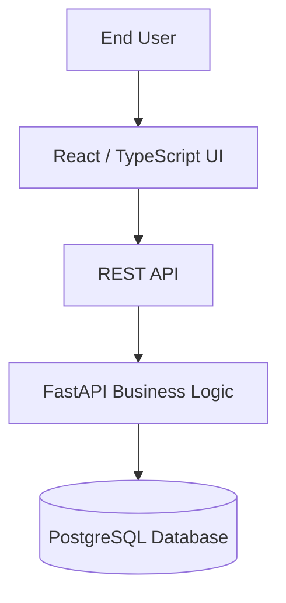

# Maintenance Operations Dashboard

React and TypeScript operations dashboard for managing equipment assets, maintenance work orders, technician assignments, and service history.

[](https://github.com/WilliamW-D/maintenance-ops-dashboard/actions/workflows/ci.yml)

**Backend Repository**: [Work Order Management API](https://github.com/WilliamW-D/work-order-api) | **Infrastructure**: [Azure Deployment Platform](https://github.com/WilliamW-D/maintenance-platform-infrastructure)

This is the frontend client for the Work Order Management system, demonstrating a modern full-stack application architecture. It communicates via REST with a secure FastAPI + PostgreSQL backend.


*(Note: Replace the placeholder image above with an actual screenshot of the dashboard)*

## What I Built

I built this dashboard to provide a clean, responsive interface for facility managers and technicians. It allows users to:
- Monitor high-priority maintenance requests and system status via interactive charts.
- View, register, and retire physical assets with a complete audit trail of maintenance history.
- Create new work orders and assign them to technicians.
- Complete work workflows with required service notes.

## Tech Stack

- **React + TypeScript + Vite**: Fast, type-safe development and production builds.
- **TanStack Query**: Robust data fetching, caching, and optimistic UI updates without complex Redux boilerplate.
- **React Hook Form + Zod**: Highly performant, strictly validated forms that enforce API schemas directly in the browser.
- **Tailwind CSS**: Responsive, utility-first styling.
- **Recharts**: Interactive data visualizations and dashboard metrics.
- **Lucide Icons**: Clean and consistent vector iconography.
- **JWT Authentication**: Fully protected routing and Axios HTTP interceptors.
- **Vitest**: Automated component DOM testing with React Testing Library.
- **Docker + Nginx**: Multi-stage production containerization.

## Architecture Context

This dashboard directly consumes the [Work Order Management API](https://github.com/WilliamW-D/work-order-api). 



## Quick Start with Docker

Clone the repository:

```bash
git clone https://github.com/WilliamW-D/maintenance-ops-dashboard.git
cd maintenance-ops-dashboard
```

Run the container (make sure your backend API is running on port 8000!):

```bash
docker compose up --build -d
```

Access the dashboard in your browser:
http://localhost:3000

## Local Development

Install dependencies:
```bash
npm install
```

Start the Vite development server:
```bash
npm run dev
```

Run the Vitest test suite:
```bash
npm run test
```
