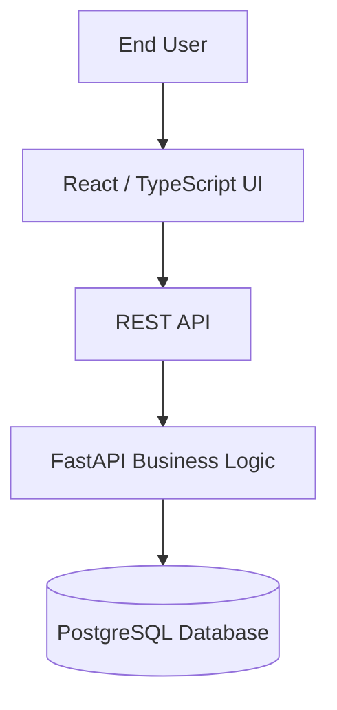

# Maintenance Operations Dashboard

React and TypeScript operations dashboard for managing equipment assets, maintenance work orders, technician assignments, and service history.

[](https://github.com/WilliamW-D/maintenance-ops-dashboard/actions/workflows/ci.yml)

**Backend Repository**: [Work Order Management API](https://github.com/WilliamW-D/work-order-api)

This is the frontend client for the Work Order Management system, demonstrating a modern, full-stack, enterprise-grade architecture. It communicates via REST with a FastAPI + PostgreSQL backend.

## Features

- **React + TypeScript + Vite**: Fast, type-safe development and production builds.
- **TanStack Query**: Robust data fetching, caching, and optimistic UI updates.
- **React Hook Form + Zod**: Highly performant, strictly validated forms.
- **Tailwind CSS**: Responsive, utility-first styling.
- **Recharts**: Interactive data visualizations and dashboard metrics.
- **Lucide Icons**: Clean and consistent vector iconography.
- **JWT Authentication**: Fully protected routing and HTTP interceptors.
- **Vitest**: Automated component DOM testing.
- **Docker + Nginx**: Multi-stage production containerization.

## Quick Start with Docker

Clone the repository:

```bash
git clone https://github.com/WilliamW-D/maintenance-ops-dashboard.git
cd maintenance-ops-dashboard
```

Run the container (make sure your backend API is running on port 8000!):

```bash
docker compose up --build -d
```

Access the dashboard in your browser:
http://localhost:3000

## Local Development

Install dependencies:
```bash
npm install
```

Start the Vite development server:
```bash
npm run dev
```

Run the Vitest test suite:
```bash
npm run test
```

## Architecture Context

This dashboard directly consumes the [Work Order Management API](https://github.com/WilliamW-D/work-order-api). The architecture mimics how microservices and separate frontend/backend teams operate in the real world:


